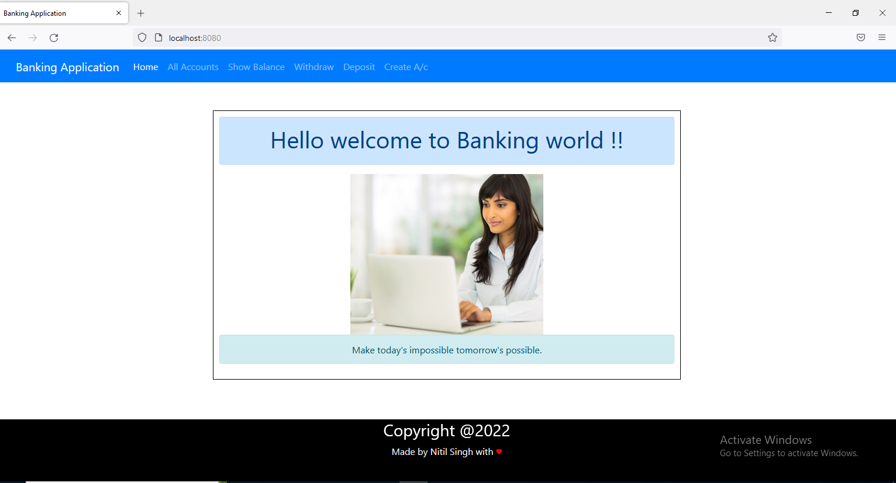
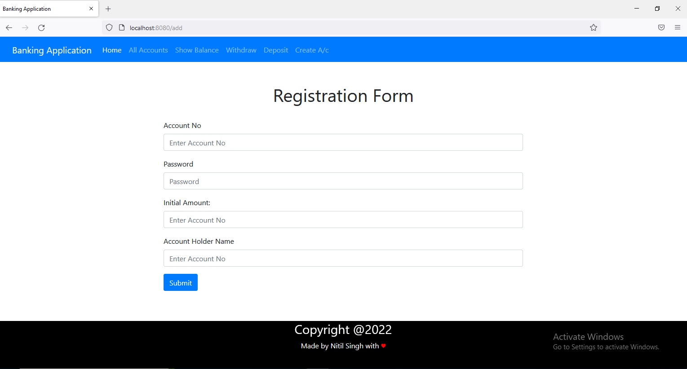
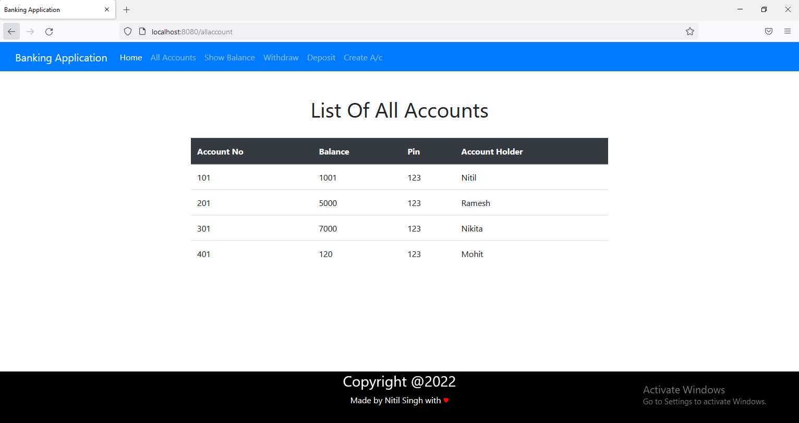
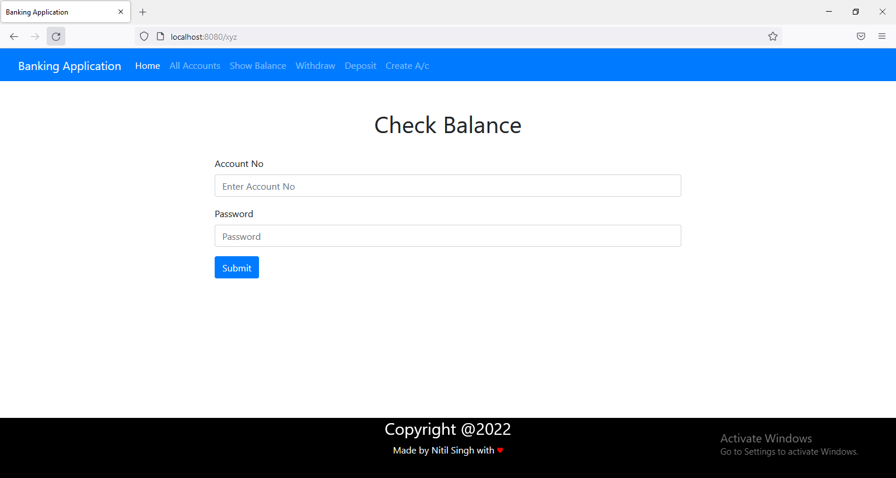
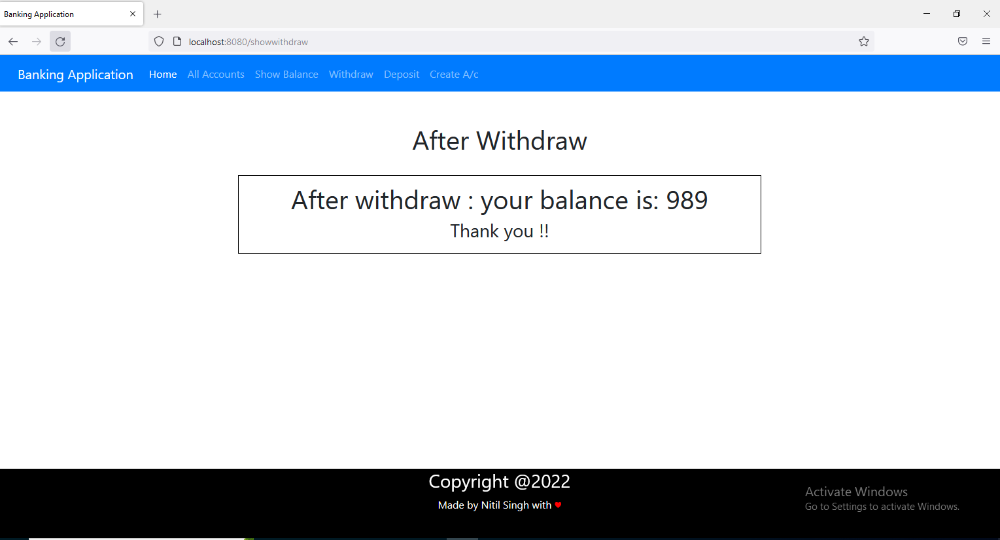

# Banking Application with Spring Boot

This is a simple banking application built using Spring Boot. The application allows you to perform basic banking operations such as creating user accounts, making transactions, and updating account balances.

## Table of Contents

- [Features](#features)
- [Prerequisites](#prerequisites)
- [Getting Started](#getting-started)
- [Project Structure](#project-structure)
- [Usage](#usage)
- [API Endpoints](#api-endpoints)
- [Technologies Used](#technologies-used)
- [ScreenShots](#ScreenShots)
- [Contributing](#contributing)
- [License](#license)

## Features

- User registration: Users can create accounts with their personal information.
- Account creation: Users can create one or more bank accounts associated with their profile.
- Balance inquiry: Users can check their account balance.
- Transactions: Users can make deposits and withdrawals from their accounts.
- Transaction history: Users can view a history of their transactions.

## Prerequisites

Before you begin, ensure you have met the following requirements:

- Java Development Kit (JDK) 11 or later installed.
- Apache Maven for building the project.
- A database system (e.g., MySQL, PostgreSQL) configured and running.
- [Spring Boot](https://spring.io/projects/spring-boot) installed.

## Getting Started

1. Clone this repository to your local machine:

   ```bash
   git clone https://github.com/yourusername/banking-application.git

The application should now be running on http://localhost:8080.
## Project Structure
The project structure follows the standard Spring Boot project layout:

  - src/main/java/com/banking/application: Java source files.
  - src/main/resources: Configuration files and static resources.
  - src/test: Test files.
  - pom.xml: Maven project configuration.
 ## Usage

  - Access the application via a web browser or API client like Postman.
  - Register a new user by making a POST request to /api/users with user information.
  - Create bank accounts for the user by making a POST request.
  - Perform transactions (deposits and withdrawals) by making POST requests.
  - Check account balances and transaction history using the respective API endpoints.
  ## API Endpoints
  - POST /api/users: Create a new user.
  - POST /api/accounts: Create a new bank account for a user.
  - GET /api/accounts/{accountId}: Retrieve account details.
  - and many more.
  ## Technologies Used
  - Spring Boot
  - Spring Data JPA
  - Spring Web
  - MySQL (or your preferred database)
  - Maven
  ## ScreenShots
  ## User Registration

To register as a new user, follow these steps:

1. Home Page:

   

2. Fill out the registration form with your personal information.

   

3. Click the "All Accounts" button to list all accounts.

   
   
5. Check Balance:

   

6. After withdraw Ammount:

   

  ## Contributing
  Contributions are welcome! If you'd like to contribute to this project, please follow these steps:

  1 Fork the repository.
  
  2 Create a new branch for your feature or bug fix.
  
  3 Make your changes and commit them with clear messages.
  
  4 Push your changes to your fork.
  
  5 Create a pull request to the original repository.
  
  ## License
  This project is licensed under the MIT License. See the LICENSE file for details.
  
  
